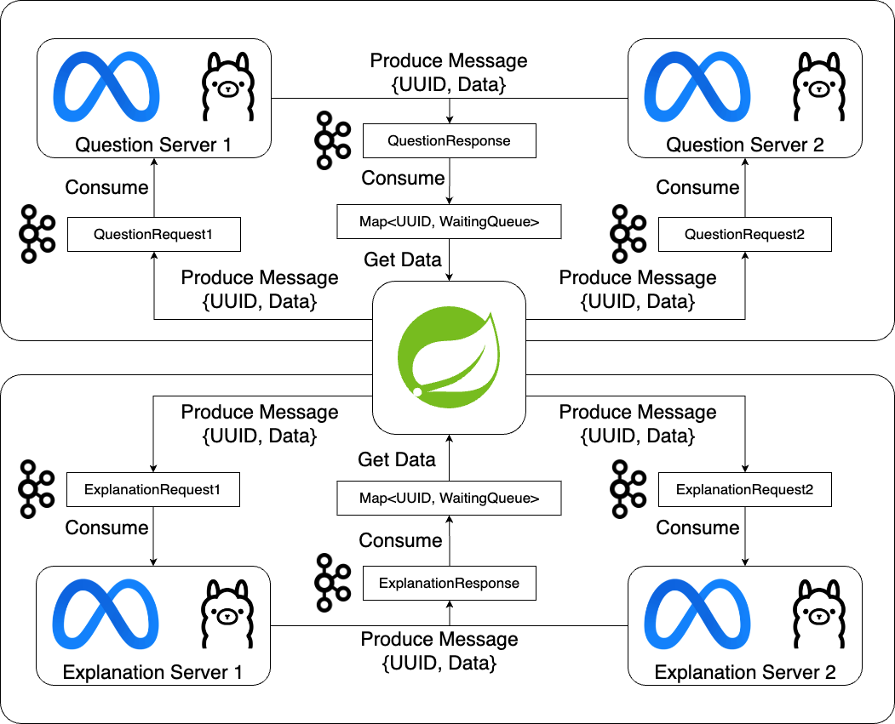

# 스프링 AI 문제 생성 서버

## 사용 기술 스택
1. Spring Boot 3.3.4
2. Spring Security
3. JWT
4. Kafka
5. Redis

## 기술 이용
1. Kafka의 Offset 메타데이터를 활용하여 실시간 대기열 확인 기능을 구현.
2. 생성에 여러 개의 Topic을 사용하여 GPU 병렬 처리 진행.
3. Spring Kafka Consumer는 생성된 문제 데이터를 받으면 UserEmail 값을 키로 분류하여 저장.
4. 사용자가 결과를 받지 않고 여러 번 생성 요청을 하기 위해, AI 생성 요청 시 Redis SETNX를 활용하여 멱등성 보장 및 1분간 재생성 불가.
5. 생성된 임시 데이터 유효기간을 설정하여 메모리 최적화.

## 기술 도입에 대한 생각
1. 지금 구현된 기능으로는 버튼을 누르고 결과가 나오기를 기다려야 하는 동기적인 로직이지만, 생성을 누르고 다른 작업을 할 수 있도록 백그라운드에서 제작하고 반환하여 문제집에 자동으로 넣어주는 완전한 비동기 로직으로 설계하는 것도 고려할 수 있음.
2. 전체 로직을 JWT와 Redis를 사용하여 모든 과정을 무상태성을 유지하도록 하여 수평 확장에 장점을 가지는 서버로 구축하였음.
3. 추후 Kafka를 단순히 생성 요청용으로만 사용하는 것이 아닌, 전체 시스템의 버스 역할로서 고부하시 레플리카 자동 수평 확장과 서버 부분 오류에도 대응이 매우 용이한 설계를 해보고 싶은 욕심이 있음.

## 핵심 구현 기능
1. AI 문제 생성
   - 최초 문제 생성 요청시, 새로운 Topic을 할당.
   - Kafka에 문제 생성 메시지가 전달되면, 전달된 Message Offset 반환. (프론트엔드에서 값 저장)
   - 이후 문제가 생성될 때까지 주기적으로 사용자가 요청한 Topic, GroupID의 현재 소비 Message Offset을 확인하여 반환.
   - 프론트엔드에서 (현재 자신의 Offset - 최근 Consume된 Offset) 계산을 통해 자신의 실시간 위치 확인.
   - 문제가 만들어지면, Redis에 데이터 임시 저장.
   - Redis에 임시 저장된 문제 데이터를 반환.
   - N개의 서버에 번갈아가며 AI 생성 요청 시도.
   
2. AI 문제 해설 생성
   - 최초 해설 생성 요청시, 새로운 Topic을 할당.
   - Redis에 임시 저장된 문제 데이터를 활용하여, Kafka로 전달할 해설 요청 데이터 생성.
   - Kafka에 해설 생성 메시지가 전달되면, 전달된 Message Offset 반환. (프론트엔드에서 값 저장)
   - 이후 문제 해설이 생성될 때까지 주기적으로 사용자가 요청한 Topic, GroupID의 현재 소비 Message Offset을 확인하여 반환.
   - 프론트엔드에서 (현재 자신의 Offset - 최근 Consume된 Offset) 계산을 통해 자신의 실시간 위치 확인.
   - 해설이 만들어지면, Redis에 데이터 임시 저장.
   - Redis에 임시 저장된 해설 데이터를 반환.
   - 저장된 문제 데이터와 해설 데이터를 합쳐서 하나의 객체로 최종 문제 데이터를 반환.
   - N개의 서버에 번갈아가며 AI 생성 요청 시도.

---

